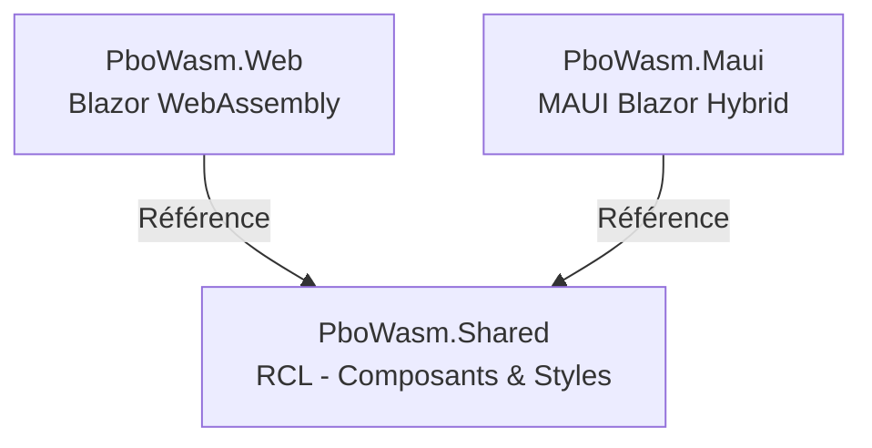

# Guide du Projet PboWasm

Ce document explique l'architecture technique multi-projets et les choix technologiques de ce projet Blazor.

## Architecture Globale (Multi-Projets)

Le projet a été divisé en trois parties pour découpler la logique de présentation (Web et Mobile/Desktop) des composants et styles partagés :



1.  **[PboWasm.Shared](file:///C:/MyDev/PboWasm/PboWasm.Shared)** (Razor Class Library - RCL) :
    *   Contient tous les composants Razor partagés (`Pages/`, `Layout/`).
    *   Contient la logique métier, les services partagés (ex. `Services/QrScannerService.cs`), et les scripts JS (`wwwroot/js/`).
    *   Gère la source des styles Tailwind CSS (`Styles/app.css`), sa configuration et sa compilation automatique.
2.  **[PboWasm.Web](file:///C:/MyDev/PboWasm/PboWasm.Web)** (Blazor WebAssembly) :
    *   Hébergeur et point d'entrée pour la version web de l'application.
    *   Référence le projet partagé pour afficher l'interface utilisateur.
3.  **[PboWasm.Maui](file:///C:/MyDev/PboWasm/PboWasm.Maui)** (.NET MAUI Blazor Hybrid) :
    *   Hébergeur et point d'entrée pour les applications mobiles et desktop (actuellement restreint à Windows pour le développement local).
    *   Utilise une `BlazorWebView` qui intègre les composants du projet partagé.

---

## Architecture CSS : Tailwind CSS + DaisyUI

Le projet utilise exclusivement **Tailwind CSS** et **DaisyUI** pour son interface graphique (les dossiers Bootstrap résiduels dans les templates par défaut ne sont pas utilisés et peuvent être ignorés).

### Tailwind CSS & DaisyUI
Toute la configuration et la gestion des styles se trouvent dans le projet **[PboWasm.Shared](file:///C:/MyDev/PboWasm/PboWasm.Shared)** :
*   **[package.json](file:///C:/MyDev/PboWasm/PboWasm.Shared/package.json)** : Dépendances npm (Tailwind CSS, DaisyUI, Autoprefixer, PostCSS).
*   **[tailwind.config.js](file:///C:/MyDev/PboWasm/PboWasm.Shared/tailwind.config.js)** : Configure les thèmes DaisyUI et scanne tous les fichiers `.razor` et `.html` du projet partagé pour extraire les classes utilisées.
*   **[Styles/app.css](file:///C:/MyDev/PboWasm/PboWasm.Shared/Styles/app.css)** : Point d'entrée CSS source avec les directives `@tailwind`.
*   **[wwwroot/css/app.css](file:///C:/MyDev/PboWasm/PboWasm.Shared/wwwroot/css/app.css)** : Le fichier CSS compilé. **Ne pas modifier ce fichier manuellement**, car il est écrasé à chaque build.

---

## Intégration des Ressources Partagées

Les projets de présentation (`PboWasm.Web` et `PboWasm.Maui`) chargent les assets statiques (CSS compilé, fichiers JS) à partir de la Razor Class Library partagée en utilisant le chemin virtuel de contenu Blazor (`_content/PboWasm.Shared/`) :

*   **Dans [PboWasm.Web/wwwroot/index.html](file:///C:/MyDev/PboWasm/PboWasm.Web/wwwroot/index.html)** :
    ```html
    <link rel="stylesheet" href="_content/PboWasm.Shared/css/app.css" />
    <script src="_content/PboWasm.Shared/js/qrScanner.js"></script>
    <script src="_content/PboWasm.Shared/js/themeManager.js"></script>
    ```
*   **Dans [PboWasm.Maui/wwwroot/index.html](file:///C:/MyDev/PboWasm/PboWasm.Maui/wwwroot/index.html)** :
    ```html
    <link rel="stylesheet" href="_content/PboWasm.Shared/css/app.css" />
    <script src="_content/PboWasm.Shared/js/qrScanner.js"></script>
    <script src="_content/PboWasm.Shared/js/themeManager.js"></script>
    ```

---

## Workflow de Développement (CSS)

### Compilation automatique (recommandée)
La compilation du CSS Tailwind est entièrement intégrée au cycle de compilation MSBuild de `PboWasm.Shared`. Lorsque vous compilez ou lancez le projet, le processus suivant est déclenché automatiquement grâce à la cible définie dans **[PboWasm.Shared.csproj](file:///C:/MyDev/PboWasm/PboWasm.Shared/PboWasm.Shared.csproj)** :
```xml
  <Target Name="Tailwind" BeforeTargets="Build;Publish">
    <Exec Command="npm install" />
    <Exec Command="npm run build:css" />
  </Target>
```

### Compilation manuelle & Mode Watch
Si vous souhaitez que les modifications de classes Tailwind soient appliquées en temps réel sans devoir recompiler tout le projet .NET :
1. Ouvrez un terminal dans le dossier **[PboWasm.Shared](file:///C:/MyDev/PboWasm/PboWasm.Shared)**.
2. Lancez le mode "Watch" :
   ```bash
   npm run watch:css
   ```

---

## Fichiers et Services Clés

*   **[PboWasm.Shared/Layout/MainLayout.razor](file:///C:/MyDev/PboWasm/PboWasm.Shared/Layout/MainLayout.razor)** : Layout principal de l'application (Navbar, Footer, gestion des thèmes DaisyUI).
*   **[PboWasm.Shared/Services/QrScannerService.cs](file:///C:/MyDev/PboWasm/PboWasm.Shared/Services/QrScannerService.cs)** : Service C# de communication avec la caméra et la bibliothèque de scan QR.
*   **[PboWasm.Shared/wwwroot/js/qrScanner.js](file:///C:/MyDev/PboWasm/PboWasm.Shared/wwwroot/js/qrScanner.js)** : Logique JS interop pour l'intégration de la caméra et du décodage QR (via `jsQR`).
*   **[PboWasm.Shared/wwwroot/js/themeManager.js](file:///C:/MyDev/PboWasm/PboWasm.Shared/wwwroot/js/themeManager.js)** : Gestion de la persistance et de l'initialisation du thème DaisyUI (clair/sombre).
